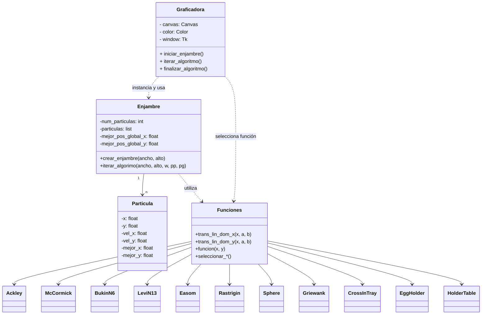

# <h1 align="center">Particle Swarm Optimization (PSO) - Pyhton - POO</h1>
## By Aleph-Zero (ℵ₀)

## 📂 ¿Qué es?

Este proyecto implementa un algoritmo de Optimización por Enjambre de Partículas (PSO) con una interfaz gráfica en Tkinter y Matplotlib para visualizar el comportamiento de las partículas sobre funciones matemáticas clásicas de benchmark. Incluye 22 funciones de prueba de un solo objetivo (incluido un problema propio) y 9 multiobjetivo.

---

## 📊 Implementación

## 🧩 Requisitos previos

- Versión mínima requerida: Python 3.7.
- Versión recomendada: Python 3.9.

Además, para la visualización de las funciones es necesario instalar
- Colour
- Matplotlib
- Numpy

## 🎮 Funcionamiento 

1. El programa se ejecuta desde 
```cmd
Proyecto/main.py
```
2. Desde la ventana principal se escoge el tipo de optimización, la función, la configuración de la gráfica y los ajustes iniciales del algoritmo.


3. Se inicia la optimización:

- Tras aparecer la gráfica inicial de la función, se inicializa  el enjambre de partículas con la letra *q*.
- Se inician las iteraciones con la letra *w*.
- **Para las funciones de un solo objetivo:**
  > - El algoritmo finaliza y la gráfica se cierra tras 20 iteraciones con el punto más óptimo de la función.
  > - Si se desea finalizar el algoritmo antes del criterio definido, se realiza con la letra *e*.
- **Para las funciones multiobjjetivo:**
  > - El algoritmo finaliza tras alcanzar el número óptimo de líderes del frente de Pareto.
  > - Se cierra la ventana con la letra *e*.

---

## 💻Autores (Aleph-Zero ℵ₀)

- Jimena González - [@Jimeeee06](https://github.com/Jimeeee06)
- Daniel Paz - [@Mayoneso-0](https://github.com/Mayoneso-0)
- Miguel Ortegón - [Miguel-Coder-24](https://github.com/Miguel-Coder-24)

---

## 🗒️Diagrama de clases




---

## 🧮 Referencias

- https://en.wikipedia.org/wiki/Particle_swarm_optimization
