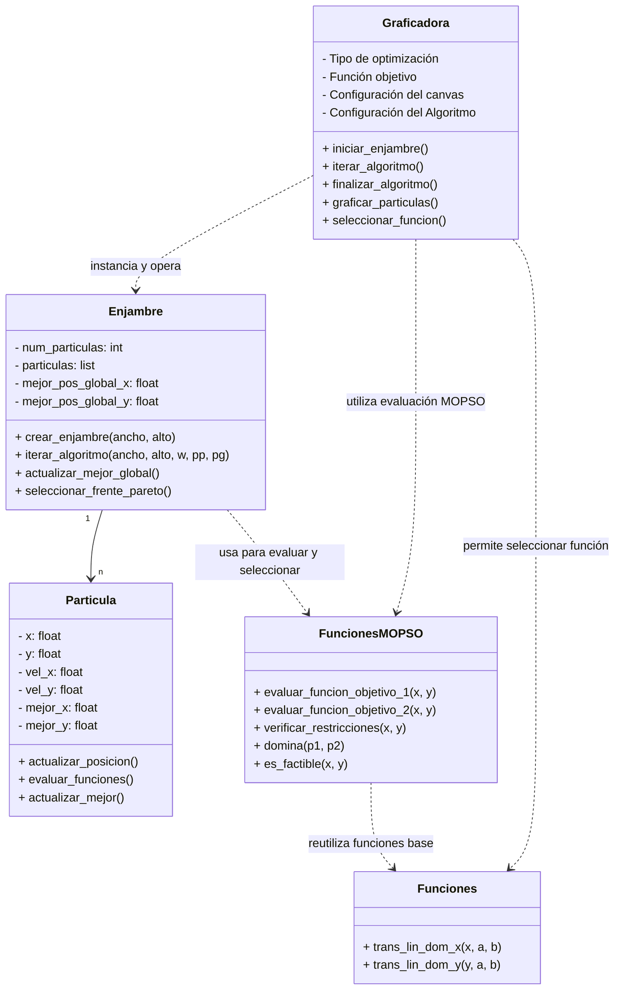

# <h1 align="center">Particle Swarm Optimization (PSO) - Pyhton - POO</h1>
## By Aleph-Zero (ℵ₀)

## 📂 ¿Qué es?

Este proyecto implementa un algoritmo de Optimización por Enjambre de Partículas (PSO) con una interfaz gráfica en Tkinter y Matplotlib para visualizar el comportamiento de las partículas sobre funciones matemáticas clásicas de benchmark. Incluye 22 funciones de prueba de un solo objetivo (incluido un problema propio) y 9 multiobjetivo.

---

## 📊 Implementación

## 🧩 Requisitos previos

- Versión mínima requerida: Python 3.7.
- Versión recomendada: Python 3.9.

Además, para la visualización de las funciones es necesario instalar con
```cmd
pip install numpy matplotlib colour
```
- Numpy
- Matplotlib
- Colour

## 🎮 Funcionamiento 

1. El programa se ejecuta desde 
```cmd
Proyecto/main.py
```
2. Desde la ventana principal se escoge el tipo de optimización, la función, la configuración de la gráfica y los ajustes iniciales del algoritmo.


3. Se inicia la optimización:

- Tras aparecer la gráfica inicial de la función, se inicializa  el enjambre de partículas con la letra *q*.
- Se inician las iteraciones con la letra *w*. En caso de ser manual, se debe presionar esta tecla para cada iteración.
- **Para las funciones de un solo objetivo:**
  > - El algoritmo finaliza y la gráfica se cierra tras encontrar definitivamente el punto óptimo en la función.
  > - Si se desea finalizar el algoritmo antes del criterio definido, se realiza con la letra *e*.
- **Para las funciones multiobjetivo:**
  > - El algoritmo finaliza tras alcanzar el número óptimo de líderes del frente de Pareto.
  > - Se cierra la ventana con la letra *e*.

---

## 💻Autores (Aleph-Zero ℵ₀)

- Jimena González - [@Jimeeee06](https://github.com/Jimeeee06)
- Daniel Paz - [@Mayoneso-0](https://github.com/Mayoneso-0)
- Miguel Ortegón - [Miguel-Coder-24](https://github.com/Miguel-Coder-24)

---

## 🗒️Diagrama de clases



```mermaid
classDiagram
direction TB

%% ==== Clases del Algoritmo ====

class Particula {
  - x: float
  - y: float
  - vel_x: float
  - vel_y: float
  - mejor_x: float
  - mejor_y: float
  + actualizar_posicion()
  + evaluar_funciones()
  + actualizar_mejor()
}

class Enjambre {
  - num_particulas: int
  - particulas: list
  - mejor_pos_global_x: float
  - mejor_pos_global_y: float
  + crear_enjambre(ancho, alto)
  + iterar_algoritmo(ancho, alto, w, pp, pg)
  + actualizar_mejor_global()
  + seleccionar_frente_pareto()
}

Enjambre "1" --> "n" Particula

%% ==== Clases de Funciones ====

class Funciones {
  + trans_lin_dom_x(x, a, b)
  + trans_lin_dom_y(y, a, b)
}

class FuncionesMOPSO {
  + evaluar_funcion_objetivo_1(x, y)
  + evaluar_funcion_objetivo_2(x, y)
  + verificar_restricciones(x, y)
  + domina(p1, p2)
  + es_factible(x, y)
}

FuncionesMOPSO ..> Funciones : reutiliza funciones base
Enjambre ..> FuncionesMOPSO : usa para evaluar y seleccionar

%% ==== Graficador UI ====

class Graficadora {
  - Tipo de optimización
  - Función objetivo
  - Configuración del canvas
  - Configuración del Algoritmo
  + iniciar_enjambre()
  + iterar_algoritmo()
  + finalizar_algoritmo()
  + graficar_particulas()
  + seleccionar_funcion()
}

Graficadora ..> Enjambre : instancia y opera
Graficadora ..> Funciones : permite seleccionar función
Graficadora ..> FuncionesMOPSO : utiliza evaluación MOPSO
```

---

## 🧮 Referencias

- https://en.wikipedia.org/wiki/Particle_swarm_optimization
